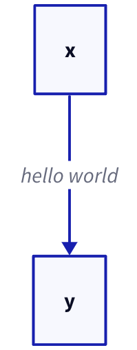
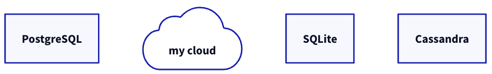

# 1 D2 install

> [D2 Install](https://d2lang.com/tour/install)

script, source 둘 중 한 가지 방법으로 설치하면 된다.(script 방식을 권장)

---

## 1.1 Install script

`curl` 명령을 이용해 서버에서 설치 스크립트를 가져온다.

- `--dry-run` 옵션은 작업의 실행 가능 여부를 검토한다.

```bash
# --dry-run 옵션으로 실행 가능 여부를 검토
curl -fsSL https://d2lang.com/install.sh | sh -s -- --dry-run
# 가능하다면 실행
curl -fsSL https://d2lang.com/install.sh | sh -s --
```

> MACOS에 homebrew가 설치되어 있어서 첫 명령을 입력했을 때 homebrew가 알아서 설치를 진행했다.

uninstall을 위해서는 다음 명령을 입력하면 된다.

```bash
curl -fsSL https://d2lang.com/install.sh | sh -s -- --uninstall
```

---

## 1.2 Install from source

```bash
go install oss.terrastruct.com/d2
```

---

## 1.3 Try it out

간단히 D2가 제대로 작동하는지 실험해 보자. 우선 다음 명령으로 간단한 .d2 파일을 생성한다.

- `echo` 명령어에 꺽쇠(>)를 붙이면 문자열을 바로 파일로 저장할 수 있다.(`echo "문자열" > 파일명`)

```bash
echo 'x -> y' > input.d2
```

"x -> y"라는 문자열이 담긴 input.d2 파일이 새로 생겼다. 이를 확인하려면 다음 명령을 입력하면 된다.

- `d2`는 해당 코드를 compile, render하는 명령이다. `d2 {file.d2} [file.svg | file.png]`처럼 사용할 수 있다.(svg, png 둘 중 하나를 선택)

- `-w` 옵션은 watch의 약자로 d2 결과물을 바로 확인하게 해 준다.

```bash
d2 -w input.d2 out.svg
```

---

# 2 Hello World

d2 파일을 작성해서 compile/render하는 방법은 알았으므로 이제 본격적인 문법을 알아보자. 다음과 같이 문자열을 작성해서 컴파일하면 x에서 y로 화살표가 생기며, 중간 설명으로 hello world가 위치하게 된다.

```c
x -> y: hello world
```



여기서 여러가지 방법으로 커스텀할 수 있다.

---

## 2.1 Shapes

위 예제에서 문자열을 감싸는 직사각형 상자도 커스텀할 수 있다. shape는 여러가지가 있는데 몇 가지 예시만 소개한다. 나머지는 shape catalog 공식 문서를 참조하자.

- `rectangle`

- `square`

- `page`

- `diamond`

- `circle`



> [shape catalog](https://d2lang.com/tour/shapes)

```python
# 객체: 문자열
# 객체.shape: shape
pg: PostgreSQL
Cloud: my cloud
Cloud.shape: cloud
SQLite; Cassandra
```

위 예시에서 pg는 아무 shape 설정을 주지 않았기 때문에 정사각형이 된다.

---

## 2.2 Connections

화살표를 그리는 방법도 여러가지가 있다.

- `--`

- `->`

- `<-`

- `<->`

---